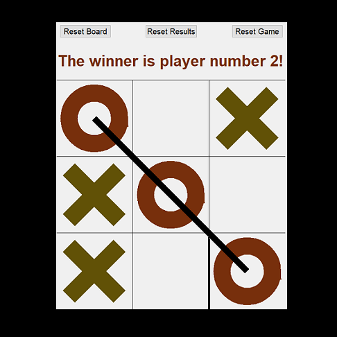

#  TicTic-TacTac-ToeToe with Tkinter

TicTacToe game for PC developed in Tkinter.
This project was abandoned to be developed in Kivy for Android support.

* The game supports 2 to 5 players.
* The grid is scalable up to 10 by 10 grid, which can be also non-symmetric.
* The number of symbols in sequence for a win can be also adjusted (or turned off if set higher than the grid).

## Screenshot

## Requirements

* tkinter
* numpy
* random
